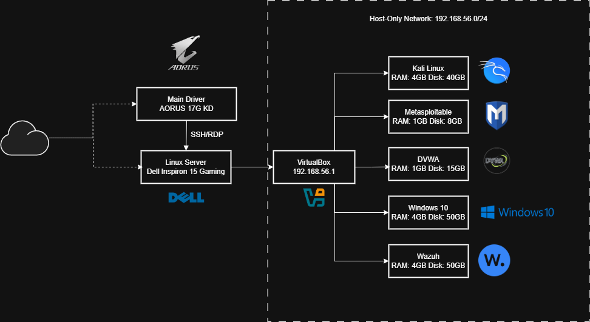

# Cybersecurity Home Lab Portfolio

## About

This repository documents my hands-on cybersecurity work across two different environments:

1. **A 5 virtual machine home lab** built on an older laptop running as a healdless server, managed remotely from my main daily driver. The lab mirrors a penetration testing environment with an isolated network, culnerable targets and defensive monitoring. 
   
2. **Cert IV in Cyber Security Coursework** completed at Victoria University Polytechnic, covering various topics such as penetration testing, network monitoring, incidence response, IAM, IT governance and more. 

## Lab Architecture

## Contents

### Reconnaissance & Information Gathering
- [Information Gathering — Metasploitable 2](reconnaissance/information-gathering-metasploitable.md)
  - Tools: Nmap, WhatWeb, Nikto, DIRB, CeWL

### Web Application Security

**SQL Injection**
- [SQL Injection — DVWA (Low Security)](web-app-security/SQL-injection/Sql-Injections-DVWA.md)
  - OWASP: A03:2021

**Broken Authentication**
- [Broken Auth & Session Hijacking — Mutillidae](web-app-security/broken-authentication/Broken-auth-mutillidae.md)
  - OWASP: A07:2021
