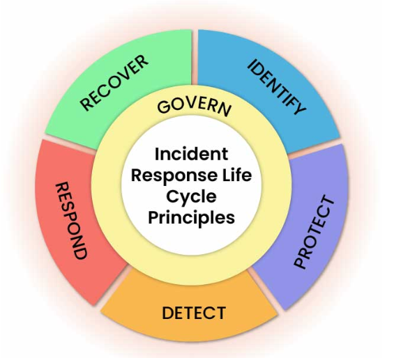
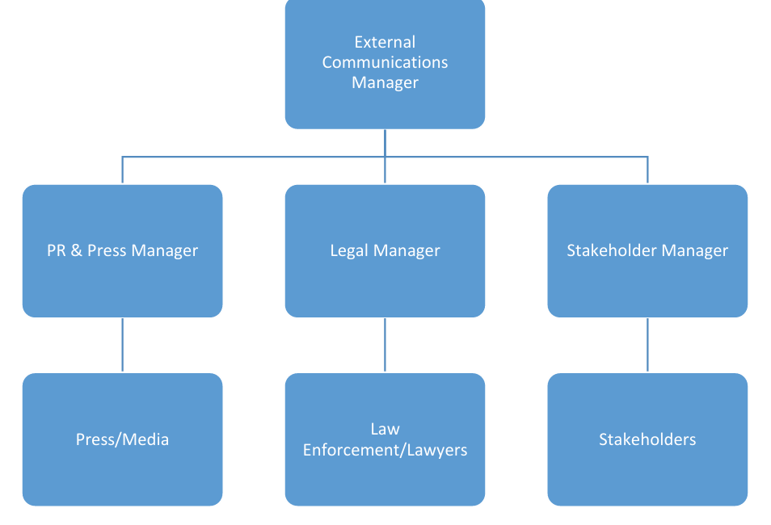

[Back to README](../README.md)

## Objective

Develop and document a complete Cyber Incident Management and Response Plan, including team formation, communication strategy, reporting hierarchy, and practical red team/blue team exercises executed in a home lab environment with Wazuh SIEM for detection and monitoring.

## Environment

| Machine | OS | Role |
| --- | --- | --- |
| Kali Linux | Kali | Red team attacker |
| Windows 10 | Windows | Target endpoint (Wazuh agent installed) |
| Wazuh Server | Linux | SIEM — log collection, alerting, threat detection |
| Metasploitable 2 | Ubuntu Linux | Secondary vulnerable target |

## What is an Incident Response Plan?

An incident response plan is a structured document that defines how an organisation detects, responds to, contains, and recovers from cyber security incidents. Without one, an organisation's response to an attack is reactive and disorganised — people don't know who to contact, what to prioritise, or how to preserve evidence.

The goal is to ensure when an incident happens, the damage is minimised as much as possible with fast recovery.

This plan follows the [NIST SP 800-61r3 Incident Response Framework](https://nvlpubs.nist.gov/nistpubs/SpecialPublications/NIST.SP.800-61r3.pdf), which defines six phases:

**Govern**

Establish and maintain the policies, roles, and oversight that drive all incident response activity. This includes; the IRP document itself, the team structure and communication protocols.

**Identify**

Understand what assets exist, what threats are relevant, and what could go wrong. Baseline logging, asset inventories, and risk assessments happen in this function.

**Protect**

Put safeguards in place before an incident occurs. This includes keeping antivirus updated, configuring firewalls, enabling monitoring agents, and training staff.

**Detect**

Monitor systems for unusual activity and identify when something has gone wrong. SIEM alerts, network monitoring, and log analysis all fall under this function.

**Respond**

Take action to contain and mitigate a confirmed incident. Isolating machines, blocking attacker IPs, preserving evidence, and coordinating the response team happen here.

**Recover**

Restore affected systems to normal operation, verify they are clean, and reconnect them to the network. Lessons learned feed back into Govern for continuous improvement.

## Incident Response Team

In a real organisation, the IRT would consist of specialised personnel. For this lab, all roles are simulated by a single operator, but the structure demonstrates understanding of how a real team would be organised.

| Name | Role | Responsibilities |
| --- | --- | --- |
| Incident Response Manager | Team lead | Coordinates all operations, communicates with management, makes decisions during incidents, ensures documentation |
| Red Team Operator | Offensive | Simulates attacks against the organisation's systems to identify vulnerabilities and test detection capabilities |
| Blue Team Operator | Defensive | Monitors systems for intrusions using Wazuh SIEM, responds to alerts, implements containment and recovery procedures |
| Purple Team Coordinator | Bridge | Ensures red team findings are used to improve blue team defences, coordinates between teams, tracks improvements |

### Supporting Roles (in a real organisation)

**Senior Management:** Strategic oversight, resource allocation, public communications

**Legal:** Regulatory compliance, breach notification obligations (e.g Privacy Act, Notifiable Data Breaches Scheme, etc.)

**HR:** Staff-related aspects of incidents (e.g. Insider threats. disciplinary actions, etc.)

**Communications:** Internal Staff updates, external media handling, etc.

## Communication Strategy

### When to Activate the Incident Response Team (IRT)

The IRT is activated when a cyber event is confirmed as a cyber incident.

**Cyber event:** Something that has the potential to become an incident but is not yet confirmed. Examples include; multiple failed login attempts, a user disabling antivirus, or unusual outbound traffic.

**Cyber incident:** A confirmed breach of security policy that threatens the confidentiality, availability, or integrity of systems or data. Examples include ransomware infection, confirmed data exfiltration, denial of service attacks, or compromised user accounts.

### Internal Communication Flow

During an incident, communication follows this chain:

1. Blue Team Operator (Detects Incident)
2. Incident Response Manager (Coordinates Response)
3. Purple Team Coordinator + Red Team Operators
4. Senior Management (Strategic Decisions, resource allocation)
5. Legal + HR + Communications

### External Communication

### Key Principles

- All internal communications during an active incident should use a dedicated channel (not regular email, which may be compromised)
- No external communication happens without IRT Manager approval
- All communications are logged for the post-incident report

## IRT Services

**Incident Detection & Response:** Monitoring systems, identifying incidents, executing containment and recovery.

**Threat Simulation/Pen Testing:** Simulating attacks to test detection and response capabilities before real attackers do.

**Incident Analysis & Reporting:** Post-incident analysis documenting what happened, how it was handled, and what needs to change.

**Security Awareness Training:** Educating staff on recognising threats (e.g. Phishing, social engineering, suspicious behaviour, etc).

**Legal & Regulatory Coordination:** Working with legal to meet breach notification obligations under Australian law.

## Common Incident Types and Initial Responses

| Incident Type | Description | Initial Response |
| --- | --- | --- |
| Malware / Ransomware | Malicious software infects a system, potentially encrypting files or exfiltrating data | Isolate the infected machine from the network immediately. Capture logs. Begin containment procedures. |
| Denial of Service (DoS/DDoS) | System is flooded with traffic, causing downtime | Identify source IPs. Apply firewall rules to block malicious traffic. Coordinate with ISP if needed. |
| Phishing / Social Engineering | User is tricked into revealing credentials or installing malware | Review affected user's email and web logs. Reset credentials. |
| Data Breach | Unauthorised access to sensitive or personal information | Contain the exposure. Alert legal and communications teams. Investigate scope and cause. |
| Compromised Account | Attacker gains access to a legitimate user account | Disable the account. Review access logs for unauthorised actions. Reset credentials and enable MFA. |

## Threat Vectors

| Vector | Example |
| --- | --- |
| Email | Phishing emails with malicious attachments or links |
| Web | Drive-by downloads from compromised websites |
| External media | Infected USB devices |
| Network | DDoS attacks, man-in-the-middle attacks |
| Insider | Malicious or negligent employee actions |
| Supply chain | Compromised third-party software or services |

## Practical Exercises (Coming Soon)

