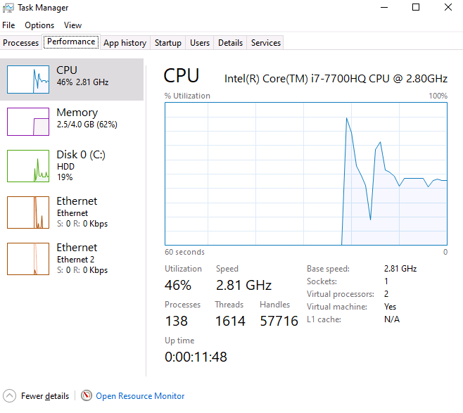
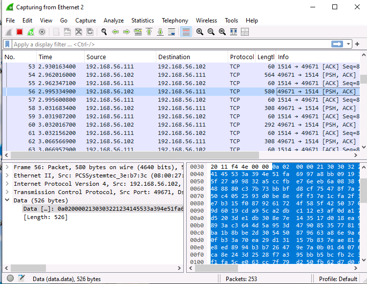
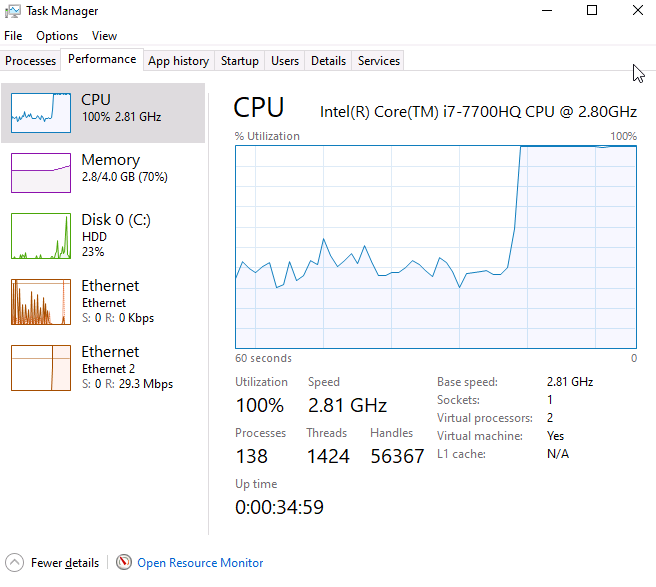
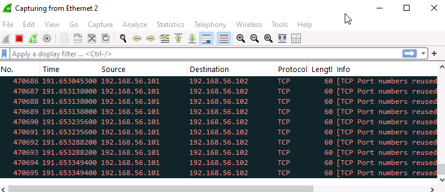
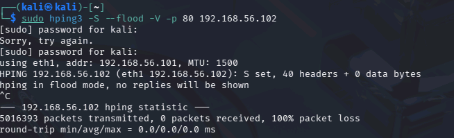
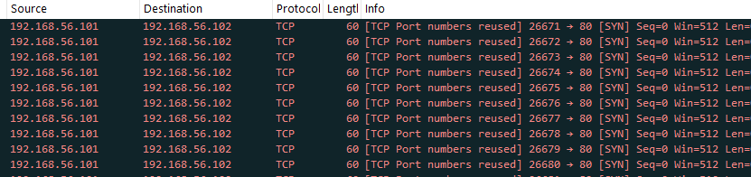
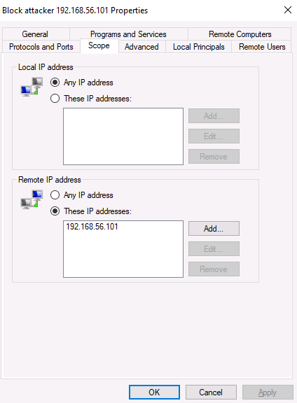
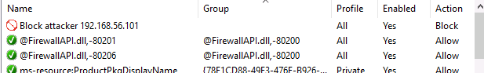
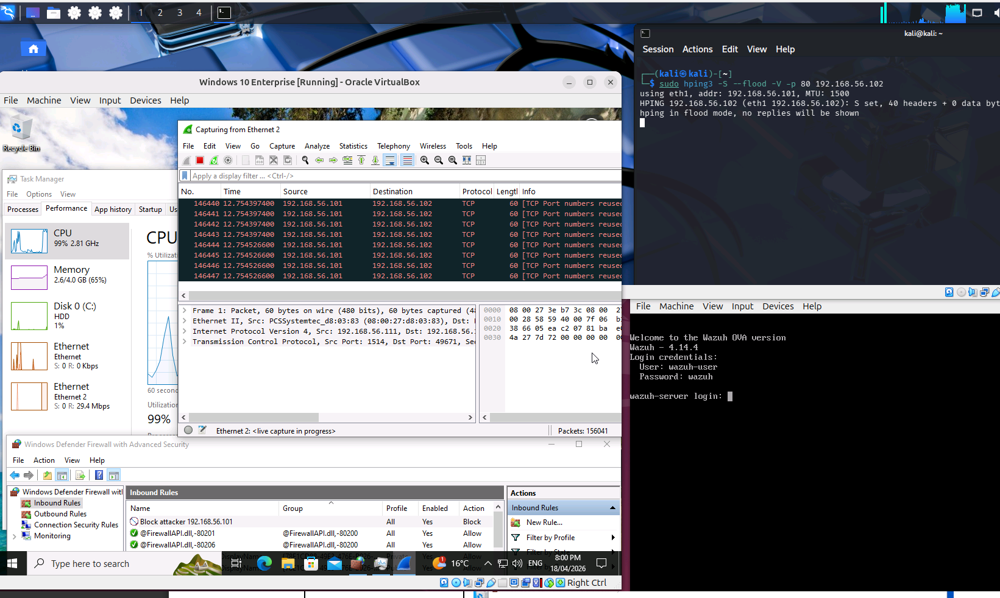
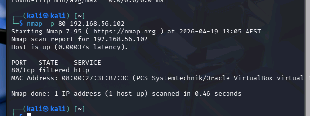

[Back to Incident Response Plan](../incident-response-plan.md)

# DoS Attack Simulation - SYN flood

## Objective

Simulate a Denial of Service attack against a Windows 10 endpoint using hping3 from Kali Linux. Monitor the attack's impact on system resources, detect it using network monitoring tools, contain it using Windows Firewall rules, and document the full response using the NIST Incident Response Framework.

## Environment

| Machine | OS | Role |
| --- | --- | --- |
| Kali Linux | Kali | Attacker — launches SYN flood |
| Windows 10 | Windows | Target endpoint |

## What is a SYN Flood?

A SYN flood exploits the TCP three-way handshake. Normally, a connection works like this:

1. Client sends a **SYN** (synchronise) packet to the server
2. Server responds with a **SYN-ACK** (synchronise-acknowledge)
3. Client sends an **ACK** (acknowledge) to complete the connection


In a SYN flood, the attacker sends thousands of SYN packets but never completes the handshake — they never send the final ACK. The server keeps each half-open connection in memory, waiting for the ACK that never comes. Eventually, the server's connection table fills up and it can no longer accept legitimate connections.

This is one of the simplest and most common denial of service attacks.

## Runbook (Red Team)

Before launching the attack, record the normal state of the Windows 10 target so the impact can be measured.

**On the Windows 10 target:**
- Open Task Manager → Performance tab. Note the current CPU usage and network activity.
- Open Wireshark and start a capture on the active network interface. Let it run for 30 seconds to establish a baseline of normal traffic.



Currently the device is settled at around a 3% usage and the network usage is not very high at all with the occasional communication with the wazuh agent server that was installed from the malware simulation playbook.



On Wireshark you can see that currently the only packets that are travelling through and from the windows system is the normal TCP three-way handshake with the Wazuh server, sending logs and messages to port 1514.

### Step 2: Launch the SYN Flood

On the Kali attacker, run:

```bash
hping3 -S --flood -V -p 80 <target-ip>
```

**What each flag does:**

`-S` — Sets the SYN flag on every packet (initiating a TCP handshake that will never complete)

`--flood` — Sends packets as fast as possible without waiting for replies

`-V` — Verbose output so we can see what's being sent

`-p 80` — Targets port 80 (HTTP). This could be any open port.

### Step 3: Observe the Impact

**On the Windows 10 target:**

While the attack is running, check Task Manager again. CPU usage and network activity should spike significantly compared to the baseline.

Switch to Wireshark — the capture should now show a flood of SYN packets all originating from the Kali attacker's IP address.



As you can see CPU usage spiked all the way to 100% while ethernet 2 (host-only network) showed 29.3 Mbps of received packets.



From Wireshark you can notice the large amount of TCP packets being sent from the IP of the Kali attacker.

### Step 4: Stop the Attack

Press `Ctrl+C` on the Kali terminal to stop hping3. Note the total number of packets sent (hping3 displays this on exit).



As you can see 5016393 packets were sent to the windows 10 machine. 

## Playbook (Blue Team)
 
### Phase 1: Identify and Protect

Before the exercise, verify that monitoring tools are ready:

- Wireshark is installed on Windows 10 for local packet capture
- Windows Firewall is enabled and accessible
- Task Manager baseline has been recorded

### Phase 2: Detect
 
**How would this be detected in a real environment?**
 
In a production environment, a DoS attack might be noticed through:
- Users reporting that services are slow or unreachable
- Network monitoring tools alerting on unusual bandwidth spikes
- SIEM alerts triggered by a high volume of connection attempts
- System performance degradation visible in monitoring dashboards

 
**Wireshark analysis:**
 
Filter the Wireshark capture to show only SYN packets from the attacker:
 
```
tcp.flags.syn == 1 && ip.src == <kali-ip>
```
 
This should show thousands of SYN packets with no corresponding ACK completions — a clear signature of a SYN flood.



As you can see, thousands of SYN packets were received with no ACK packets corresponding with them, indicating the SYN flood attack. 

**Identifying the attacker:**
 
From the Wireshark capture, identify:
- The source IP address of the attack
- The target port
- The volume of packets/connections

From my lab:

- Source IP: 192.168.56.101
- Target Port: 80
- Volume: 5016393 packets

### Phase 3: Respond

**Step 1: Block the attacker at the firewall**

On the Windows 10 target, create a new inbound firewall rule to block the attacker's IP:

1. Open Windows Defender Firewall → Advanced Settings
2. Inbound Rules → New Rule
3. Select "Custom" rule type
4. Set to apply to all programs
5. Under Scope, add the attacker's IP address to "Which remote IP addresses does this rule apply to?"
6. Set the action to "Block the connection"
7. Apply to all profiles (Domain, Private, Public)
8. Name the rule (e.g. "Block DoS Attacker — <attacker-ip>")





**Step 2: Verify the block is working**



As seen above, the firewall inbound rules are actually not enough to block the flood of SYN requests. This is not due to error, as debugging this issue we can see that nmap scanning port 80 shows that the port is being filtered:



This occurs because hping3 sends raw SYN packets that are processed at the network adapter level before the Windows Firewall can evaluate and drop them. The system still expends CPU cycles receiving and discarding each packet, even though no TCP connection is ever established.

This is a limitation of host-based firewalls - they operate too high in the network stack to fully mitigate a raw packet flood.

### Why Host-Based Firewalls Are Not Enough

In a real-world scenario, effective DoS mitigation requires blocking traffic before it reaches the target machine:

**Network-level firewall (e.g. pfSense):** A dedicated firewall sitting between the attacker and the target can drop malicious packets before they ever reach the endpoint's network adapter. Rate limiting and SYN cookie support at this level would prevent the flood from consuming endpoint resources.

**Intrusion Detection/Prevention System (e.g. Suricata):** An IDS/IPS can detect SYN flood patterns automatically and trigger blocks without manual intervention. Integrating Suricata with Wazuh would also provide centralised alerting for network-level attacks.

**SYN cookies:** Enabling SYN cookies at the OS or firewall level allows the server to handle half-open connections without allocating memory for each one, reducing the effectiveness of SYN floods.

This exercise demonstrated that endpoint detection (Wireshark, Task Manager) is effective for identifying a DoS attack, but endpoint containment alone is insufficient. A layered defence approach with network-level controls is essential for real mitigation.

**Step 3: In a real scenario**

Blocking a single IP works for a basic DoS from one source. A real DDoS attack comes from thousands of IPs (a botnet), which makes individual IP blocking impractical. In that case, you would:

- Contact your ISP to implement upstream filtering
- Use a DDoS mitigation service (e.g. Cloudflare, AWS Shield)
- Rate-limit incoming connections at the network edge

### Recover

**Incident Summary:**
- What happened? (SYN flood from a single attacker IP targeting port 80)
- When did it start and stop? (Timestamps from Wireshark)
- What was the impact? (CPU spike, network usage spike, potential service degradation)
- How was it contained? (Windows Firewall rule blocking the attacker IP)
  
**Detection Effectiveness:**
- How quickly was the attack identified after it started?
- Was the Wireshark baseline comparison useful in identifying the anomaly?

**Improvements:**
- Consider deploying Suricata (network IDS) alongside Wazuh for deeper network-level detection
- Create custom Wazuh rules that alert when connection attempts from a single IP exceed a threshold within a time window
- Implement automated firewall responses (e.g. active response in Wazuh that auto-blocks IPs exceeding connection thresholds)
- For production systems, implement SYN cookies and connection rate limiting at the OS or firewall level

**Note**

Further write ups on Pfsense and Suricata coming soon. 

[Back to Incident Response Plan](../incident-response-plan.md)


