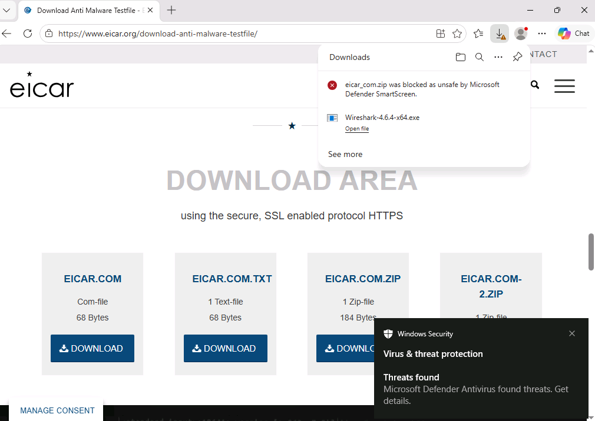
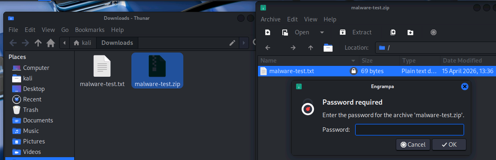
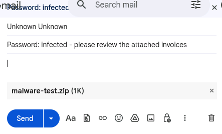
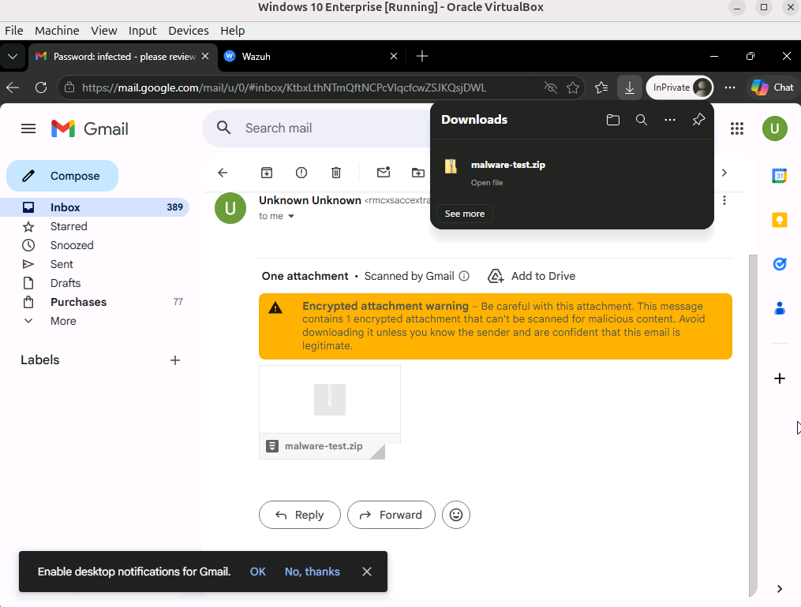
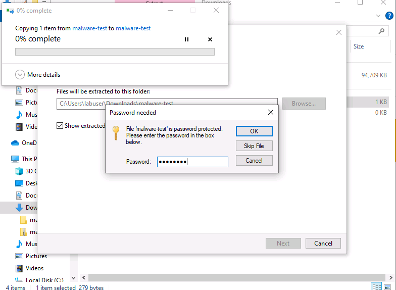
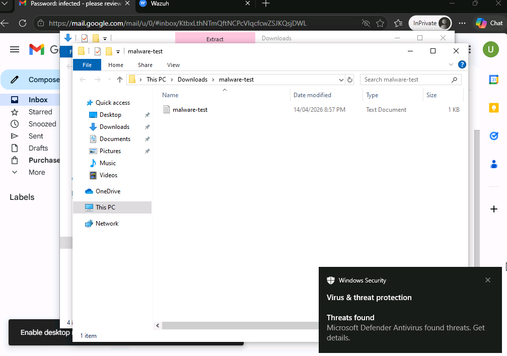
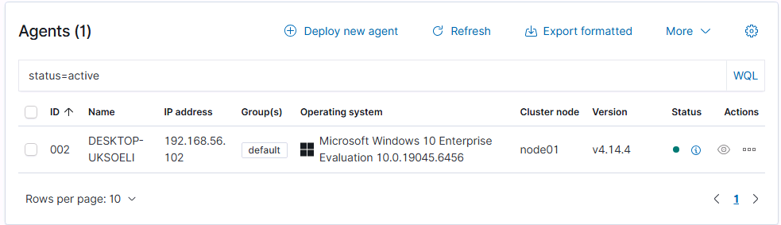
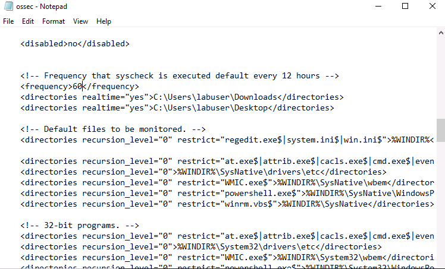
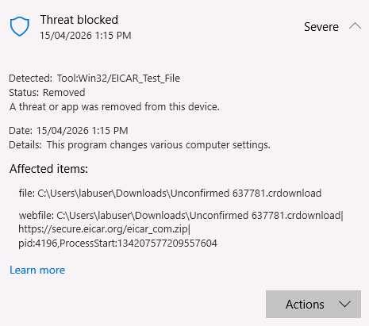

[Back to Incident Response Plan](../incident-response-plan.md)

# Malware Simulation — EICAR Test File

Simulate a malware infection on a Windows 10 endpoint using the EICAR test file, delivered via two vectors (browser download and email attachment). Test whether Wazuh SIEM detects the file through File Integrity Monitoring (FIM) and whether Windows Defender contains the threat. Document the full response using the NIST CSF 2.0 framework.

## Environment

| Machine | OS | Role |
| --- | --- | --- |
| Kali Linux | Kali | Attacker — prepares and sends the malicious file |
| Windows 10 | Windows | Target endpoint — Wazuh agent + Windows Defender |
| Wazuh Server | Linux | SIEM — collects logs, monitors file integrity |

## What is the EICAR Test File?

The EICAR test file is a standardised file created by the European Institute for Computer Antivirus Research specifically for testing antivirus software. It is not actually malware — it contains a harmless string that every legitimate antivirus product is designed to detect and flag as malicious.

This makes it safe to use in a lab environment while still triggering real detection behaviour from security tools. If an antivirus doesn't detect it, there is a genuine configuration problem.

## Runbook (Red Team)

The runbook documents the steps to execute the simulated attack.

**Step 1:** On the Windows 10 target, open a browser and navigate to the [EICAR download page](https://www.eicar.org/download-anti-malware-testfile/).

**Step 2:** Attempt to download the EICAR test file.

**Step 3:** Log what happens — does the browser block it? Does Windows Defender catch it before or after download?


 
Windows Defender should detect the file immediately and quarantine the file on arrival.

### Attack Vector 2: Email Attachment

The browser download is one vector, an attacker could pose as a legitimate website to have a user download a malicious file. Another realistic scenario is malware delivered via email, where the file may be password-protected to bypass email scanning.

**Step 1:** On the Kali attacker, download the EICAR test file:

**Step 2:** Zip the file with a password to simulate how real attackers bypass email scanners:

```bash
zip --password infected malware-test.zip malware-test.txt
```

The password protection prevents Gmail/Outlook from scanning the contents of the zip file.



**Step 3:** Send the zip file as an email attachment from a dummy email account to the Windows 10 machine. Include the password in the email body ("Password: infected — please review the attached invoice").



**Step 4:** On the Windows 10 target, download the attachment and extract it using the provided password.



As you can see gmail will still send a warning about the encrypted file.



**Step 5:** Log what happens when the file is extracted — does Windows Defender detect it?



Once Windows Defender catches it after it is extracted, it is immediately quaranteened and removed from the extracted folder. 

### Why Two Vectors Matter

The browser download tests the most basic layer of defence — if the antivirus can't catch a file being downloaded directly, nothing else matters.

The email vector tests a more realistic attack path. Password-protected zips bypass automated email scanning, meaning the file only gets checked when the user manually extracts it. This is how a significant number of real malware infections happen - the user is the one who defeats the email security by entering the password. In a real attack, the email would try to look legitimate, in order to disguise itself, this is a common form of a social engineering attack.

## Playbook (Blue Team)
 
The playbook documents the defensive response following the NIST CSF 2.0 functions.
 
### Identify & Protect
 
Before the exercise begins, verify that all defensive tools are ready:
 
- Windows Defender is enabled and definitions are up to date (should automatically be onn)
- Wazuh agent is installed on Windows 10 and reporting to the Wazuh manager
- File Integrity Monitoring (FIM) is enabled in Wazuh for the Downloads and Desktop directories with `realtime="yes"`





### Detect

When the EICAR file is downloaded or extracted, two things should happen:

**Windows Defender** detects the file and either blocks the download or quarantines it after extraction. This can be verified locally through Windows Security → Virus & threat protection → Protection History.



**Wazuh File Integrity Monitoring** detects the new file landing in the Downloads or Desktop directory. Even though the file is quickly quarantined by Defender, FIM should capture the moment it appeared.

On the Wazuh dashboard, navigate to the agent → File Integrity Monitoring. Look for alerts showing a new file created in the monitored directory.


**Comparing the two vectors:**
- **Browser download:** Defender should catch this before the file fully saves to disk, so FIM did not trigger.
- **Email attachment:** Since the zip was password-protected, the file was only detected on extraction. FIM captured the extracted file appearing in the directory before Defender modifies and removes it. 

### Respond

In this simulation, Windows Defender handled containment automatically (quarantine). In a real incident with actual malware that evades detection, the blue team would need to:

1. **Isolate** the infected machine from the network immediately to prevent it moving to other systems
2. **Capture evidence** by screenshotting the Wazuh FIM alerts, export relevant logs, note the file hash and path
3. **Run a full system scan** to check for additional threats
4. **Quarantine or delete** the malicious file
5. **Check for persistence** - real malware often creates scheduled tasks, registry run keys, or additional files to survive reboots
6. **Restore** any affected files from backup if needed
7. **Reconnect** the machine only after confirming it is virus free

### Recover

After the exercise, document the following:

**Incident Summary:**
- What was the threat? (EICAR test file simulating malware)
- How was it delivered? (Browser download and password-protected email attachment)
- When was it detected? (Timestamps from Defender and Wazuh FIM)
- What action was taken? (Automatic quarantine by Windows Defender)


**Detection Gaps:**
- Was there any delay between the file arriving and being detected?
- Did the password-protected zip bypass any detection layer?
- Did Wazuh FIM capture the file creation before Defender removed it?

**Improvements:**
- Tighten email attachment policies to block password-protected archives

## Findings

- **Simulated Threat:** Malware download via browser and email
- **Detection Tools:** Windows Defender (endpoint antivirus), Wazuh SIEM (file integrity monitoring)
- **Browser vector:** Defender catches this immediately — the most basic layer of defence working as expected
- **Email vector:** Password-protected zips bypass email scanning, creating a detection gap that only closes when the user extracts the file
- **Key Takeaway:** Endpoint antivirus is the last line of defence for email-delivered malware. Centralised monitoring via Wazuh provides visibility across all endpoints — a new file appearing in a monitored directory is logged even if the antivirus removes it seconds later. Without FIM, the only evidence of the infection would exist on the individual endpoint.


[Back to Incident Response Plan](../incident-response-plan.md)
