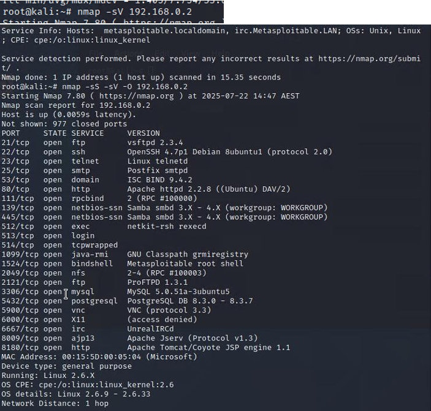
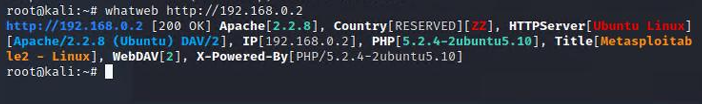
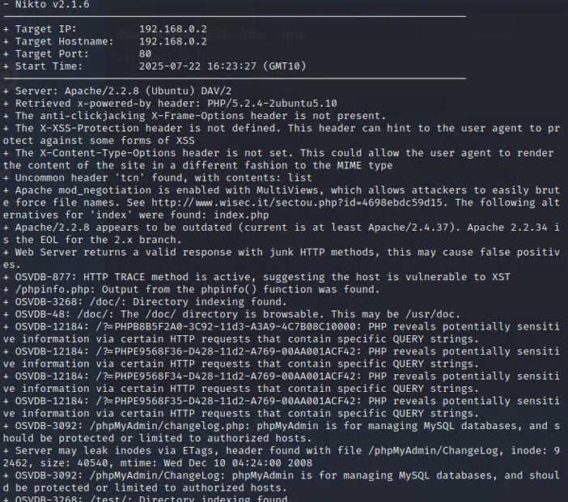
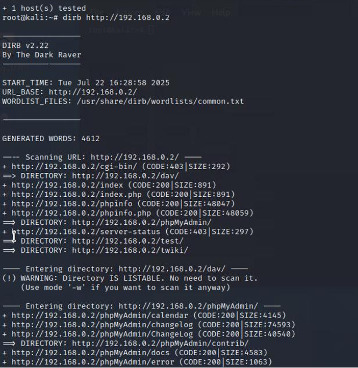
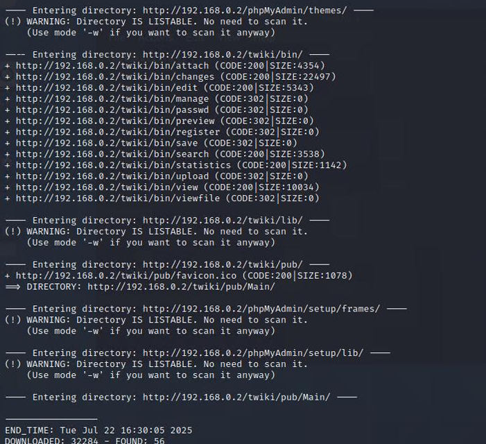
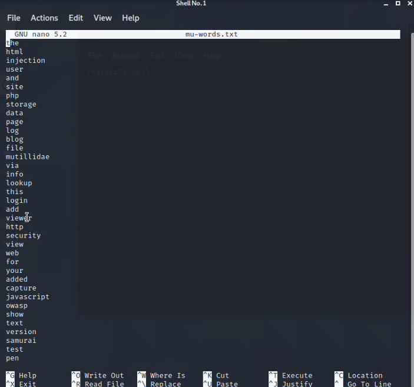

# Reconnaissance & Information Gathering — Metasploitable 2

## Objective

Perform the initial reconnaissance phase of a penetration test against a target web server. The goal is to identify the technology stack, discover vulnerabilities, map the application structure, and gather intelligence before launching any attacks.

In a real engagement, this phase determines what attacks are even possible.

## Environment

| Machine | OS | Role |
|---|---|---|
| Kali Linux | Kali | Attack platform |
| Metasploitable 2 | Ubuntu Linux | Target web server |

**Network:** Isolated host-only network

## Why Reconnaissance Matters

Without knowing your target, how can you hit them? The information gathering phase answers critical questions:

- What operating system and software is the target running?
- Are there known vulnerabilities in those specific versions?
- What pages and directories exist, including ones not linked publicly?
- What words and naming conventions does the application use (useful for password attacks)?

Each tool in this phase answers a different question. Together, they build a complete picture of the target before a single exploit is attempted.


## Phase 1: Footprinting the Technology Stack

**Tools used:** Nmap, WhatWeb

### Nmap Service Scan

```bash
nmap -sV <target-ip>
```

`-sV` probes open ports to detect what service and version is running on each one. This tells us what software the server is exposing to the network.




### WhatWeb Fingerprinting

```bash
whatweb <target-ip>
```

WhatWeb identifies web technologies by analysing HTTP headers, HTML content, and JavaScript. It often catches things Nmap misses, like the specific programming language or CMS in use.




### Results

| Component | Version Identified |
|---|---|
| Server OS | Ubuntu Linux (kernel 2.6.9–2.6.33) |
| Web Server | Apache 2.2.8 |
| Programming Language | PHP 5.2.4-2ubuntu5.10 |

### Analysis

Every component identified is severely outdated:

**Apache 2.2.8** 

Reached end of life years ago. Modern Apache is on version 2.4.x. Older versions have known vulnerabilities including directory traversal and denial of service.

**PHP 5.2.4** 

PHP 5 has been unsupported since 2018. This version is vulnerable to numerous exploits including remote code execution.


**Linux kernel 2.6.x** 

Decades old and contains privilege escalation vulnerabilities that have long been patched in modern kernels.

This immediately indicates the server is a soft target. The outdated software means there are likely many known exploits available, and patching has clearly been neglected.


## Phase 2: Vulnerability Scanning

**Tool used:** Nikto

```bash
nikto -h <target-ip>
```

Nikto is a web server scanner that checks for dangerous configurations, missing security headers, and known vulnerabilities. Unlike Nmap which focuses on ports and services, Nikto focuses specifically on web server security.




### Some Vulnerabilities Found

**1. Missing X-Frame-Options header**

Without this header, the site is vulnerable to clickjacking — an attack where the site is loaded inside an invisible iframe on a malicious page, tricking users into clicking things they didn't intend to.

**2. Missing X-XSS-Protection header**

This header tells browsers to activate their built-in XSS filters. Without it, the browser won't block reflected XSS attacks even when it detects them.

**3. Missing X-Content-Type-Options header**

Without this header set to `nosniff`, the browser may try to guess the content type of a response. An attacker could upload a file that looks like an image but is actually JavaScript, and the browser might execute it.

**There are a plethora of other vulnerabilities**

There are many more vulnerabilities, but these three stood out as the most significant.

### Analysis

All three missing headers are quick fixes that should be standard on any production web server. The fact that none of them are present suggests the server was deployed with default settings and never hardened — further confirming that security was not a priority in the configuration.

---

## Phase 3: Directory and Content Discovery

**Tool used:** DIRB

```bash
dirb http://<target-ip>
```

DIRB performs a dictionary-based brute force scan against the web server, trying common directory and file names to find resources that aren't linked anywhere on the site. These hidden directories often contain admin panels, backup files, configuration pages, or test environments that were never meant to be publicly accessible.





### Results

DIRB discovered **56 accessible objects and directories** on the server. Among these are paths to applications like DVWA and Mutillidae, as well as potentially sensitive directories that are not linked from any public page.

### Analysis

Hidden directories are a common attack surface. Developers often leave test pages, admin panels, or backup files on production servers assuming they're safe because they're not linked. However, any resource on the server can be found through brute force if its name is predictable.


## Phase 4: Web Spidering and Word List Generation

**Tool used:** CeWL

```bash
cewl -d 1 -w mu-words.txt --lowercase http://<target-ip>/mutillidae
```

`-d 1` limits the spidering depth to 1 level (just the immediate pages linked from the homepage). `--lowercase` normalises all words to lowercase. `-w mu-words.txt` saves the output to a file.

CeWL crawls a website and extracts every unique word it finds, saving them as a word list. This is useful for password attacks — people often use words related to their work, company, or application as passwords. A custom word list built from the target's own content is far more effective than a generic dictionary.



### Results

| Position | Words |
|---|---|
| First 5 | the, html, injections, user, and |
| Last 5 (not shown on image) | loopback, reason, parsed, conf, changing |

### Analysis

The word list reveals the language and terminology used across the application. Words like "injections", "parsed", and "conf" suggest the application is security-related or developer-facing. In a real engagement, this word list would be fed into tools like Hydra for brute-force login attacks, significantly increasing the chances of cracking passwords compared to using a generic dictionary.


## How This Recon Fed Into the Attacks

The information gathered in this phase directly enabled every subsequent attack in this repository:

| Discovery | How It Was Used |
|---|---|
| Open ports and services (Nmap) | Mapped the full attack surface of the server |
| Apache 2.2.8 / PHP 5.2.4 identified | Confirmed the server is running outdated, vulnerable software |
| Missing security headers (Nikto) | Indicated poor security configuration, suggesting input validation would also be weak |
| Hidden directories found (DIRB) | Revealed the locations of DVWA and Mutillidae for targeted testing |
| Word list generated (CeWL) | Can be used for password brute-force attacks against discovered login pages |


Without this phase, the attacks that followed would have been guesswork. Reconnaissance turns a blind assessment into a structured, methodical penetration test.

## Recommendations

**1. Update all software to current supported versions**

Apache, PHP, and the Linux kernel should all be updated to their latest stable releases. Running end-of-life software exposes the server to every vulnerability discovered since those versions were abandoned.

**2. Add security headers to the web server configuration**

At minimum, configure the following headers in Apache:

```apache
Header always set X-Frame-Options "DENY"
Header always set X-XSS-Protection "1; mode=block"
Header always set X-Content-Type-Options "nosniff"
```

**3. Review other vulnerabilities identified by Nikto**

Review all other vulnerabilites shown by Nikto and patch them. 

**4. Remove or restrict access to non-public directories**

Audit all directories on the server and remove anything that doesn't need to be publicly accessible. For necessary admin pages, restrict access by IP address or require additional authentication.

**5. Implement rate limiting and blocking for scanning tools**

Tools like Nikto and DIRB generate hundreds of requests in seconds. Implementing rate limiting or using a web application firewall (WAF) can detect and block automated scanning attempts.