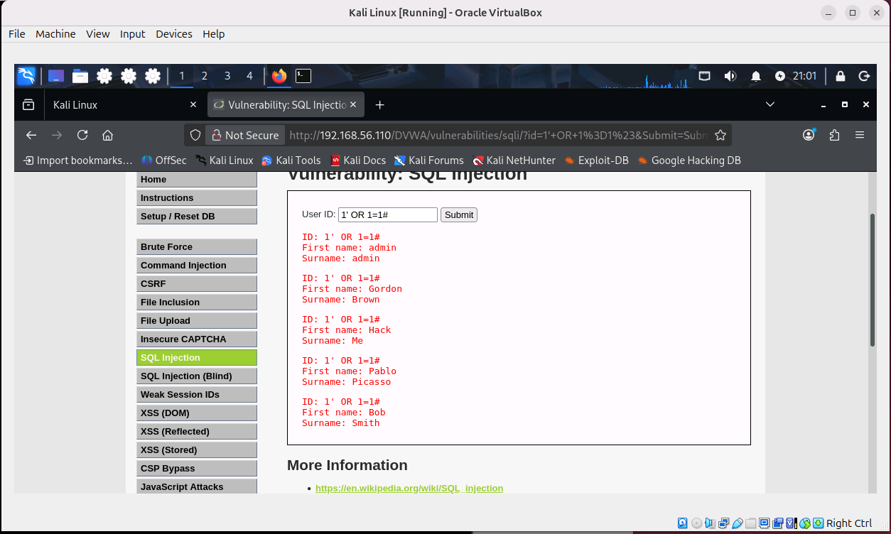
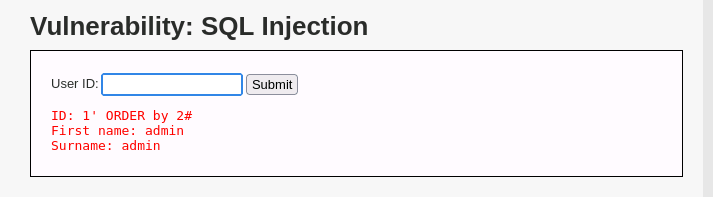
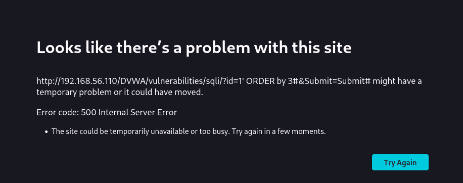
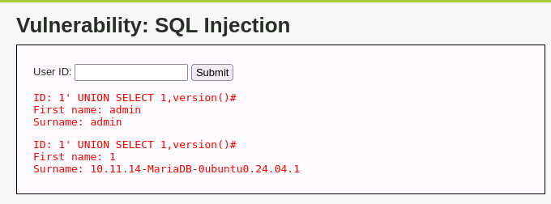
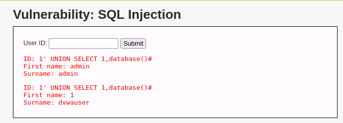
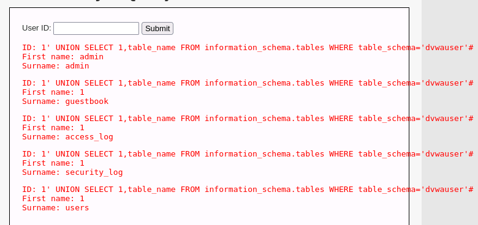
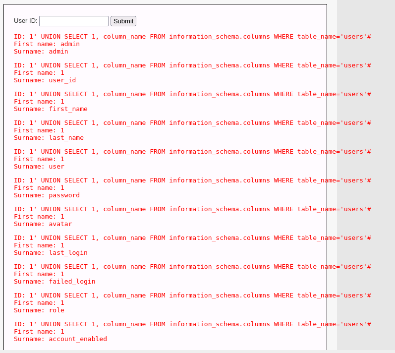
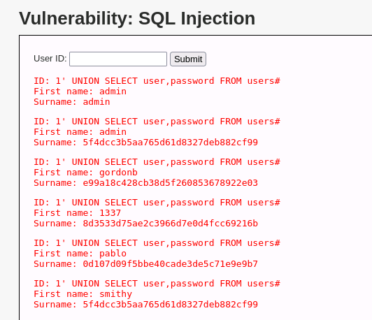
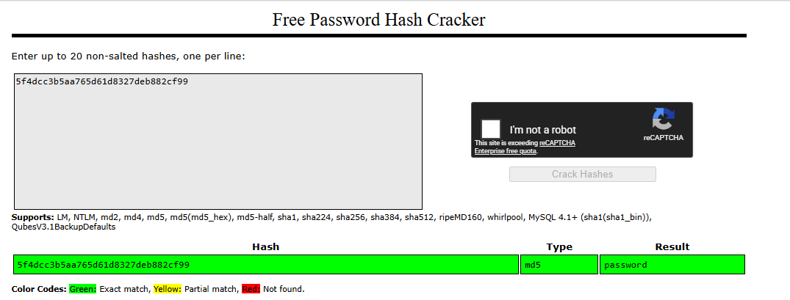
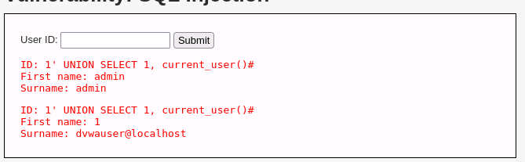

# SQL Injection — DVWA (Low Security)

## Objective
 
Test the DVWA "SQL Injection" module using injection techniques — from basic data extraction to discovering the database structure, dumping passwords, and identifying the database version.

## Evironment

 
| Machine | OS | Role |
|---|---|---|
| Kali Linux | Kali | Attack platform |
| Metasploitable 2 | Ubuntu Linux | Hosts DVWA web application |

**Target application:** Damn Vulnerable Web Application (DVWA)

**DVWA security level:** Low

**Network:** Isolated host-only network


## Information

An SQL injection occurs when an application passes a user input directily into an SQL query. If the input field does not filter out special characters such as quotes or logical SQL operators, attackers can use these inputs to return data that they shouldn't have access to. They could even potentially also add, modify or delete data records completly.

DVWA's SQL Injection module can simulate this by providing a simple "User ID" lookup form that is backed by a database query. The original query that is running behind the form should look like:

```sql
SELECT first_name, last_name FROM users WHERE user_id = '$input';
```

All injections bellow takes advantage of the 'input' portion of the code and appending additional SQL logic, beyond what is expected.

## Attack 1: Dumping All Users

**SQL Query:**
```
1' OR 1=1#
```
**What the Code Does**: 

1 - A valid User ID which allows the first part of the query to work normally

' = This single quote ends the quote that the applicaiton opened since the query looks like WHERE user_id = '$input'. This single quote replaces the final quote in the input early, meaning anything typed after is treated as sql code.

OR - An SQL logic operator which tells the query if either the left or right side is true

1=1 - Simple logic that makes on of the sides always true. (because one always equals one)

'#' - This simply comments out everything afterwards like the missing quote that was replaced previously.

Putting it all together the query becomes:

```sql
SELECT first_name, last_name FROM users WHERE user_id = '1' OR 1=1#';
```
**Logic**

The WHERE clause checks every single row in the table one by one to see if the entry satisfies the condition user_id = '1' OR 1=1#'

It will parse through every single entry and since the condition 1=1 is always true, it will give us the whole table.

**Result**



All Users within the database now have their first and last names displayed. 

## Attack 2: Determining the Number of Columns
 
It is possible to figure out how many columns the original query can return by using the `ORDER BY` and incrementing the function until it breaks:
 
**SQL Query 1:**
```
1' ORDER BY 2#
```
 
**SQL Query 2:**
```
1' ORDER BY 3#
```

**SQL Query 3:**
```
1' ORDER BY 4#
```

**SQL Query `n`:**
```
1' ORDER BY `n`#
```
 
**What the Code Does:**
 
1' - Same as before, a valid ID followed by a single quote to close the input early
 
ORDER BY 2 - This tells SQL to sort the results by the second column. If the query has at least 2 columns, this works fine.
 
ORDER BY 3 - This asks SQL to sort by a third column. If only 2 columns exist, the database throws an error because column 3 doesn't exist.

'#' - Comments out the rest of the query
 
**Logic**
 
By incrementing the ORDER BY number until we get an error, we can figure out exactly how many columns the original query returns. This will be important for the next attacks within this documentation.

**Result**



By using SQL query 1 (ORDER BY 2) no errors popped up when sorting the data with column 2 suggesting there are at least 2 columns in the database.



By using SQL query 2 (ORDER BY 3) an error did pop up which means that there are not 3 columns in the database. 


## Attack 3: Finding the Database Version
 
Now that we know there are 2 columns, it is possible to use `UNION SELECT` to inject our own query alongside the original one.
 
**SQL Query:**
```
1' UNION SELECT 1,version()#
```
 
**What the Code Does:**
 
1' - Valid ID and closing quote as before
 
UNION SELECT - This appends a second query to the original one. The results of both queries get combined into one output. The second query must return the same number of columns as the first one (which is why Attack 2 was necessary).
 
1 - A placeholder value to fill the first column (since we need to match 2 columns)
 
version() - A built-in MySQL function that returns the exact version of the database software running on the server
 
'#' - Comments out the rest

 
**Logic**
 
Knowing the exact database version lets an attacker search for known vulnerabilities specific to that version. For example, certain MySQL versions have bugs that allow even more advanced exploitation.

**Result**



We now know that the database is running MariaDB 10.11.14 ubuntu 24.04.1

**What if there were more columns of data?**

```
-- For a query with 2 columns (like DVWA):
1' UNION SELECT 1,version()#

-- If the query had 3 columns:
1' UNION SELECT 1,2,version()#

-- If the query had 4 columns:
1' UNION SELECT 1,2,3,version()#

-- If the query had `n` columns:
1' UNION SELECT 1,2,....,n-1, version()#
```

## Attack 4: Finding the Current Database Name

**SQL Query:**
```
1' UNION SELECT 1,database()#
```
 
**What the Code Does:**
 
1' - Valid ID and closing quote
 
UNION SELECT 1 - Appends a second query with a placeholder in the first column
 
database() - A built-in MySQL function that returns the name of the database currently being used by the application
 
'#' - Comments out the rest
 
**Logic**
 
This tells us which database the web application is connected to. We need this name for the next attacks where we query the database structure.

**Result**



We now know that the name of the database is dvwauser which will be used for the next attack.

## Attack 5: Listing All Tables in the Database

**SQL Query:**
```
1' UNION SELECT 1,table_name FROM information_schema.tables WHERE table_schema='dvwauser'#
```
 
**What the Code Does:**
 
1' - Valid ID and closing quote
 
UNION SELECT 1,table_name - Appends a second query that asks for table names, with a placeholder in the first column
 
FROM information_schema.tables - Every MySQL server has a built-in database called `information_schema` that stores information about all other databases, tables, and columns on the server. We are querying this to find out what tables exist.
 
WHERE table_schema='dvwauser' - Filters the results to only show tables that belong to the `dvwauser` database (the name we found in Attack 4)
 
'#' - Comments out the rest
 
**Logic**
 
Now we can see every table inside the dvwauser database.

**Result**



We can see that the tables in the database are 'users', 'guestbook', 'access_log', 'security_log'. The most important table is 'users' as  this is most likely where login credentials are stored.

## Attack 6: Listing All Columns in the Users Table
 
**SQL Query:**
```
1' UNION SELECT 1,column_name FROM information_schema.columns WHERE table_name='users'#
```
 
**What the Code Does:**
 
1' - Valid ID and closing quote
 
UNION SELECT 1,column_name - Asks for column names this time instead of table names
 
FROM information_schema.columns - Queries the columns metadata from information_schema
 
WHERE table_name='users' - Filters to only show columns belonging to the `users` table (which we found in Attack 5)
 
'#' - Comments out the rest
 
**Logic**
 
This reveals the exact structure of the users table.

**Result**



Now we know every column name like `user_id`, `first_name`, `last_name`, `user`, `password`, etc. Now we know exactly which columns to target to extract credentials in the next attack.
 
## Attack 7: Dumping Usernames and Password Hashes
 
**SQL Query:**
```
1' UNION SELECT user,password FROM users#
```
 
**What the Code Does:**
 
1' - Valid ID and closing quote
 
UNION SELECT user,password - This time instead of using a placeholder, both columns are real column names from the users table. We are asking for the `user` and `password` columns directly.
 
FROM users - Pulling from the users table we discovered in Attack 5
 
'#' - Comments out the rest
 
**Logic**

This is the most damaging attack. It returns every username and their corresponding password hash from the database. The passwords are not stored in plain text but as hashes. These hashes could also possibly be cracked with tools like Hashcat or even websites like CrackStation depending on how well the passwords have been hashed.

**Result**



As Shown above the names of the users are shown in the first name column and the hashed passwords are shown on the last nmame column. 




It is possible to unhash the passwords as shown above as the database uses a relatively weak hashing algorithm (md5).

## Attack 8: Identifying the Current Database User
 
**SQL Query:**
```
1' UNION SELECT 1,current_user()#
```
 
**What the Code Does:**
 
1' - Valid ID and closing quote
 
UNION SELECT 1 - Placeholder for the first column
 
current_user() - A built-in MySQL function that returns which MySQL user account the web application is using to connect to the database
 
'#' - Comments out the rest
 
**Logic**
 
If this returns something like `root@localhost`, the web application has full administrative access to the database. This means an attacker could potentially not just read data, but also insert new records, delete tables, or even access other databases on the same server. A properly secured application should use a limited account with only the minimum permissions needed.

**Result**



As shown, the current database user is dvwauser@localhost. Since this user is not a root user, it means that it is some sort of limited user account rather than a root account. While this is a positive and there is some level of privelege restriction in place, it still has enough access to read all user credentials as shown in the previous attacks. 


