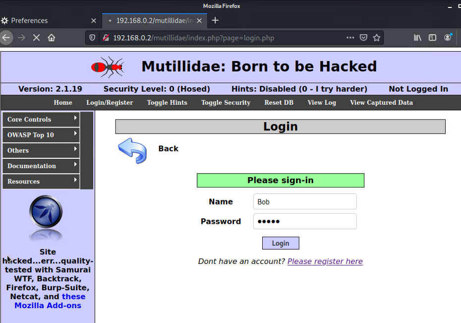
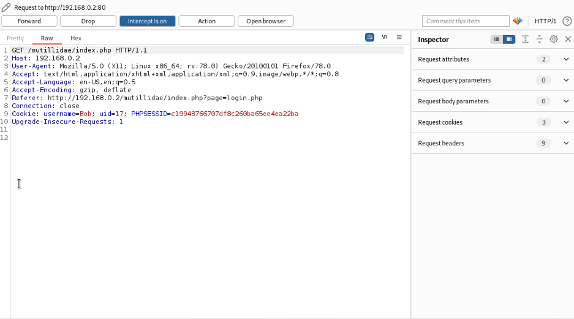
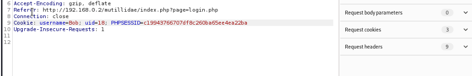
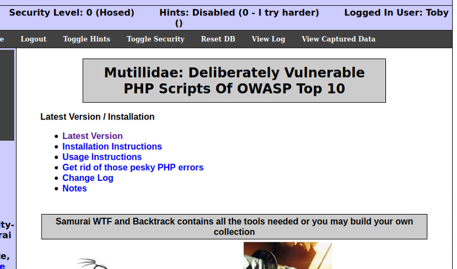
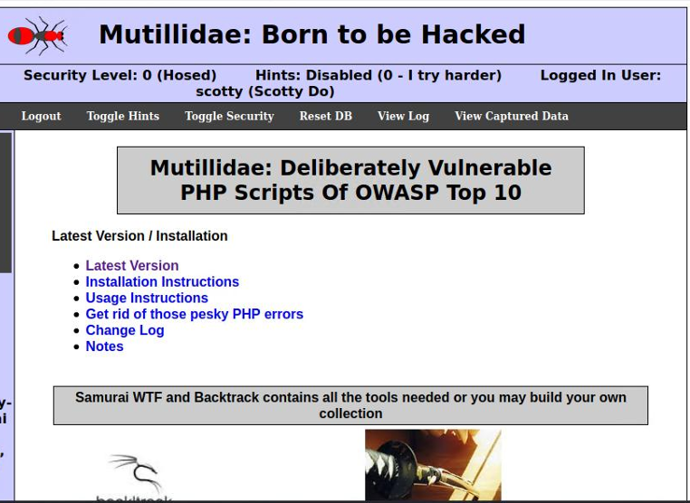

# Broken Authentication & Session Hijacking — Mutillidae

## Objective

Test the Mutillidae web application for session management weaknesses and attempt to impersonate other users by manipulating session cookies.

## Environment

| Machine | OS | Role |
|---|---|---|
| Kali Linux | Kali | Attack platform |
| Metasploitable 2 | Ubuntu Linux | Hosts Mutillidae web application |

**Target application:** Mutillidae (hosted on Metasploitable 2)
**Tools used:** Burp Suite Community Edition (intercepting proxy)
**Network:** Isolated host-only network

## Background

When you log into a web application, the server creates a session and sends your browser a cookie containing a session identifier. On every subsequent request, your browser sends that cookie back so the server knows who you are.

If the session cookie contains predictable values — like a simple user ID or username in plain text — an attacker can intercept the cookie using a proxy tool and modify those values to impersonate another user. This is a broken authentication vulnerability because the server trusts the cookie without properly verifying the user's identity on the server side.

## Methodology

### Step 1: Setting Up Burp Suite as an Intercepting Proxy

1. Configured Firefox's network settings to route traffic through a manual proxy at `127.0.0.1` on port `8080`
2. Opened Burp Suite and enabled interception under the Proxy tab

This setup allows every HTTP request between the browser and the web application to be captured and modified before it reaches the server.

### Step 2: Creating Test Accounts

Registered two user accounts on the Mutillidae website:

- **User 1:** Bob (Password: Bobby)
- **User 2:** Toby (Password: Brown)

### Step 3: Intercepting the Session Cookie

1. Logged in as User 1 (Bob)
2. Burp Suite captured the HTTP request, which included a cookie containing the username and a user ID (uid)

As Bob logs in, his cookie will be intercepted by Burp Suite through the manual Proxy. 

As shown, after forwarding the request, Burp Suite successfully intercepted the HTTP traffic, revealing user credentials (username and password) within the login request, as well as session-related data including the UID parameter, which becomes very important for what comes next.

### Step 4: Manipulating the Cookie

Modified the cookie values in Burp Suite, changing the username and uid to match User 2 (Toby), then forwarded the modified request to the server.

While changing the username and password values, I realised it wasn’t even necessary - simply modifying the UID after intercepting the session token was enough to gain access to another account.

### Step 5: Confirming Account Takeover

The server accepted the modified cookie without any additional verification, granting full access to Toby's account.

### Step 6: Escalation — UID Enumeration

Discovered that changing only the uid value (without knowing the username) was enough to access arbitrary accounts. By incrementing the uid to values like `11`, access was gained to accounts that were not created during this test — including pre-existing accounts on the system.

This means an attacker could iterate through user IDs and access every account on the platform without knowing any credentials.

This is another account I hadn’t registered beforehand, but was still fully accessible just by changing the UID to 11 (unlucky Scotty Do).

## Findings

- **Vulnerability:** Broken Authentication & Weak Session Management
- **Location:** Mutillidae session cookie handling
- **Severity:** High
- **CVSS Base Score:** 9.0
- **CVSS Overall Score:** 8.5
- **Impact:** Complete account takeover of any user on the platform. An attacker does not need the target's username or password — only a valid uid value, which can be guessed by simply iterating through the numbers. This grants access to all user data and functionality associated with the compromised account.

## Real World Attack Scenario (Extra Research)

In this lab, the attack was performed locally using Burp Suite, but in a real-world environment, an attacker would need a way to intercept another user’s traffic.

One realistic scenario would be a shared or insecure network (e.g. public Wi-Fi). An attacker could perform an ARP spoofing attack using tools such as Ettercap or Bettercap to position themselves as a man-in-the-middle between the victim and the server.

Once in this position, the attacker could:

- Intercept HTTP login requests and capture user credentials
- Capture or modify session cookies in transit
- Manipulate the uid value in the cookie to impersonate other users

Because the application does not use secure session handling or encryption, this attack could be performed without needing direct access to the victim’s machine.

## What a User Can Do (Extra Research)

While this vulnerability ultimately needs to be fixed on the server side, there are still a few things users can do to reduce their risk:

**1. Use HTTPS whenever possible**

Always check that the site is using HTTPS instead of HTTP. HTTPS encrypts traffic, preventing attackers from easily intercepting login credentials or session cookies.

**2. Avoid untrusted or public Wi-Fi networks**

On open networks, attackers can perform man-in-the-middle attacks to intercept traffic between the user and the server.

**3. Use a VPN on insecure networks**

A VPN encrypts your traffic between your device and the VPN server, making it much harder for attackers on the same network to capture sensitive data.

**4. Log out after using web applications**

This helps ensure session tokens are invalidated and cannot be reused.

## Remediation

**1. Use secure, random session tokens**

Replace predictable values like sequential user IDs with long, cryptographically random session tokens (e.g., a 128-bit random string). This makes tokens impossible to guess or enumerate.

**2. Regenerate session tokens on login**

Issue a new session token every time a user authenticates. This prevents session fixation attacks where an attacker sets a known session token before the victim logs in.

**3. Validate sessions server-side**

Never trust cookie values for identity. The server should maintain a session store that maps each token to a user record. Every request should be validated against this store — if the token doesn't match, the session is rejected.

**4. Implement session expiry and invalidation**

Sessions should expire after a period of inactivity and be fully invalidated on logout. This limits the window of opportunity for an attacker using a stolen or manipulated token.